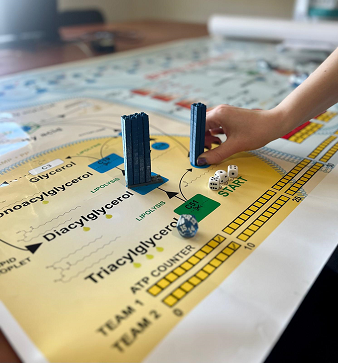
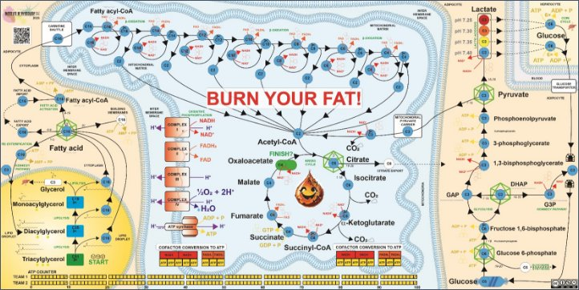
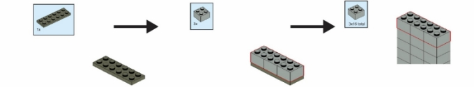

version 1.4

# **BURN YOUR FAT!** DIY board game rules
Biochemistry game for two teams (players)
# THE STORY
Everyone has ever thought about how to get rid of excess fat. It is good to know at least some scientific information for successful weight loss strategies. Fat depots, which in humans are stored in the abdominal cavity or buttock area, are mostly made up of triacylglycerol molecules, abbreviated TG. To get rid of these TG molecules and convert them into carbon dioxide (CO2) and water, we need the help of several metabolic pathways and enzymes.
# GAME PARTS
1. Playing board. Print the board on A0 format paper.
1. Three D6 ![ref1] and two D20 ![ref2] dice. Buy them.
1. Tokens (pawns) called <b>NADH</b>, <b>FADH2</b>, <b>ATP</b>. Print them using a 3D printer, 30 pieces of <b>NADH</b> in red and <b>FADH2</b> in orange, and 14 <b>ATPs</b> in yellow. STL files are attached. Or use color-coded pawns from other board games. 
1. Building blocks (aka LEGO bricks), one per one carbon. 3D-print ~50 pieces in one color and ~50 pieces in another color. Grey and blue work well. STL files are attached. (Original LEGO works fine if you have enough bricks)
1. Neutral building blocks for carbons in the Krebs cycle. 3D-print 16+ pieces in white color.
1. At least two glycerol backbone bricks. Get a 2×6 plate from LEGO.
1. Step counter and convertor table for each team/player. Print them.
1. The minimum number of players is two, but teams of 4+ are preferred. Estimated time is 40 minutes.

# ![ref3]SCIENTIFIC BACKGROUND
- Degradation of lipids, namely triacylglycerols, releases two important primary end products: fatty acids and glycerol. This happens at the surface of lipid droplets and in the cytoplasm of a cell.
- Fatty acids must be activated – converted to a reactive coenzyme A ester called fatty acyl-CoA – before they can be degraded in mitochondria or used in other reactions. This takes energy in the form of adenosine triphosphate (**ATP**).
- Fatty acyl-CoA must enter the mitochondrial matrix, where β-oxidation occurs, to be "burned" and converted to energy for the cells.
- Mitochondrial β-oxidation runs in spirals. The acyl chain is gradually oxidized, and acetyl-CoA's two-carbon atom unit is cleaved from the parent fatty acyl-CoA at each turn.
- Mitochondrial β-oxidation produces reduced forms of cofactors nicotinamide adenine dinucleotide (<b>NADH</b>) and flavin adenine dinucleotide (<b>FADH2</b>), coenzymes carrying electrons from one reaction to another.
- The cofactors are used in the electron transport chain and oxidative phosphorylation pathway in mitochondria to generate a gradient of protons and synthesize **ATP** that provides energy to living cells.
- Acetyl-CoA generated by mitochondrial β-oxidation is used in the Krebs cycle (citric acid cycle) to produce reduced forms of cofactors and ATP equivalent guanosine-5'-triphosphate (**GTP**).

# Let's get to it. Build your fat!
Set up two teams. Each team takes one color of carbon atoms (building bricks). Assemble one typical fat molecule – triacylglycerol (TG) – from LEGO bricks. Each triacylglycerol consists of three fatty acids and one glycerol backbone. Build tripalmitoylglycerol. Palmitic acid has 16 carbon atoms. The carbons are represented by 2×2 bricks, and the glycerol is represented by the flat 2×6 plate. The team/player who builds the TG molecule first starts the game. 

## PREPARE THE BOARD
1. Deploy the cofactors to their locations. Dashed <b>NADH</b> to red hexagons <b>⬡</b>, <b>FADH2</b> to orange pentagons <b>⬠</b>, and <b>ATP</b>s to gold squares <b>▢.</b> 
1. Assemble four white carbons into C4 metabolite for Krebs cycle. Make four of them and place them in the oxaloacetate green field. Ignore the right part of the board (**GLYCOLYSIS** extension) for the first game.
1. Place the TG molecules at the starting place called C51 (a molecule containing 3×16 carbon atoms in palmitates and 3 carbon atoms as glycerol).
1. Place the yellow **ATP** tokens at position 10 at the **ATP COUNTER** to have enough energy to start.
1. Define members of each team as: 
   1. the **walker** (rolls dice ![ref1]![ref1]![ref1] and walks with the molecules)
   1. the **counter** (uses the step counter to keep track of how many steps can be used)
   1. the **converter** (collects the cofactors, uses cofactor conversion table to generate **ATP**s, moves **ATP** token within **ATP** counter)
   1. the **strategists** (observe the board, roll D20 ![ref2], and define the best strategy to gain **ATP**s)
1. Start the game.
## GAME OVERVIEW
Generate 100 units of <b>ATP</b> via metabolic reactions degrading the TG molecule. Collect cofactors (<b>NADH</b>, <b>FADH2</b>), convert them into <b>ATP</b>, and record <b>ATP</b> units using the <b>ATP COUNTER</b>.
## THE GAME ROUNDS AND RULES
### **LIPOLYSIS PATHWAY**
1\. Teams place their parent TG molecules on the game board **START** field. Each team gets 10 **ATP** units.

2\. The teams throw three six-sided dice ![ref1]![ref1]![ref1] in turn to be the number of steps for their round. The **walker** rolls dice and moves the molecule(s) from circle to circle (one step) following the arrows. At the beginning, the first step is to cleave palmitic acid C16 from the triacylglycerol and put the palmitic acid on **a blue** circle labeled C16, meaning 16 carbon atoms, and the remaining diacylglycerol on a **blue** field C35 (now containing only 35 carbons). Each cleavage (splitting into two daughter molecules and moving them to the appropriate fields) counts as one step. The **counter** keeps track of how many steps the walker made. When the first team finishes all moves, the second team rolls the dice. There can be multiple molecules from both teams on the same field.

3\. When the molecule stops on or passes the scissors symbol, it has to be cleaved according to the board rules. Only molecules with the correct number of carbon atoms can be placed on the **blue** circle. The other part of the molecule goes directly to the next **blue** circle.

4\. The team can proceed within **LIPOLYSIS PATHWAY** to liberate more palmitic acid molecules or move with the palmitic acid molecule along the pathway to **CYTOPLASM**. Given the thrown number of dots, multiple molecules can be advanced in one turn independently, or one molecule can be rushed directly to the Krebs cycle.

### **FATTY ACID PATHWAYS IN CYTOPLASM**
5\. There are multiple pathways in the cytoplasm as it is the main crossroad for the fatty acids.

6\. When the molecule stops on or passes the ***icosahedron*** symbols, the **strategist** has to roll the twenty-sided dice ![ref2]. This defines the metabolic future of the molecule. The next pathway to go is selected based on the thrown number.

` `![ref4] *1-5*   - The fatty acid molecule gets esterified to the nearest available glycerol and has to be liberated again.

` `![ref4] *6-8*   - The fatty acid molecule is exported and/or imported to the cell, which takes a few more steps.

` `![ref4] *9-19* - The fatty acid proceeds towards the **MITOCHONDRIAL BETA OXIDATION PATHWAY**.

` `![ref4] *20    -* The fatty acid is used to build new membranes and has to be removed from the game.

7\. When the molecule stops on or passes the **blue** circle crossed by **a gold arrow**, the corresponding **ATP** or **GPT** molecule is degraded or produced, respectively. The **converter** adjusts the **ATP COUNTER** marker position accordingly. It takes two ATP to activate a fatty acid.

### **MITOCHONDRIAL BETA-OXIDATION PATHWAY**
8\. The corresponding cofactor is generated when the molecule stops on or passes the circle crossed by <b>an orange</b> or <b>red</b> arrow. The cofactors can be converted to <b>ATP</b> via oxidative phosphorylation and electron transport chain only when the <b>COFACTOR CONVERSION TO ATP</b> table is fully filled (get 5 <b>ATP</b> for every two red <b>NADH</b> tokens and get 3 <b>ATP</b> for every two <b>FADH2</b> tokens). Then, the team gains <b>ATP</b>, and the <b>converter</b> adjusts the <b>ATP COUNTER</b> marker position accordingly. When the cofactors are used to generate <b>ATP</b>, place them back on board to keep metabolism running.

9\. The team can decide to either directly proceed with the truncated fatty acid via the **BETA OXIDATION PATHWAY** or with acetyl-CoA to the **KREBS CYCLE** or take any other action with their molecule(s).

### **KREBS CYCLE**
10\. To enter the cycle, the acetyl-CoA two-carbon unit C2 has to merge with oxaloacetate molecule C4. There are 4 oxaloacetate molecules in the neutral color "white," which does not belong to any player and can be used by any team. Neutral C4 intermediates (starting from succinyl-CoA) can be moved by any team to get the energy and to recycle oxaloacetate for their next incoming C2 metabolite.

11\. When the molecule lands on or passes the ***icosahedron*** symbols, the **strategist** has to roll the twenty-sided dice ![ref2]. The next pathway to go is selected based on the thrown number.

` `![ref5] *1-18*   - The molecule proceeds via the **KREBS CYCLE**.

` `![ref4] *19-20* - The citrate was exported to **CYTOPLASM** for other pathways and is removed from the game.

12\. The molecule ends its journey within the **KREBS CYCLE** at the **FINISH** field. The two carbons were already released as CO2, and the electrons converted to **ATP**. However, to keep the metabolism running, the cofactors and oxaloacetate must be recycled for the next turn.

## END OF THE GAME
All cofactors should be converted to **ATP** during the game. The team that earns 100 units of **ATP** wins the game immediately. If the team consumes all **ATP**s, the game ends for that team. 
# ![ref3]![ref3]RULES FOR REAL EXPERTS
The acetyl-CoA C2 carbon units are released as CO2 more complicatedly. The position and the history of each carbon matter. When assembling the citrate C6, put the incoming C2 carbons at the bottom of the stack. The incoming acetyl-CoA is not released as CO2 during the first turn of the cycle, but the two "old = white" carbons from the top are released. The succinate then contains two "old" carbons at the top and two "new" carbons at the bottom of the stack. Fumarate is a symmetrical molecule, so roll a die D6 ![ref1] to randomize the output: 1-3 means keep the orientation of the stack, 4-6 means put the "new" carbons at the top of the stack. When this oxaloacetate enters the second turn of the Krebs cycle, it can be used only by the player owning the carbons. The new carbons go to the bottom of the stack when creating the citrate. Either the older "white" carbons or the "first round carbons" can be released as CO2 in this turn. Then again, the fumarate is a symmetrical molecule, so roll the D6 ![ref1], etc. In this game, use six neutral "white" oxaloacetates to keep metabolism running.

In reality, carbon tracing is even more complicated and requires PhD-level experts.
# EXTENSION #1: THE SUGARS STRIKE BACK
![ref3]Glucose and its three-carbon minions will not let you burn your fat easily. Play the game with the **GLYCOLYSIS** pathway extension.
### **GLYCOLYSIS PATHWAY**
1\. Teams can use up to 8 glucose C6 molecules in the game. Glucose enters the game at **Glucose** field at any time. It behaves as any other molecule in the game.

2\. The first ***icosahedron*** symbol

` `![ref5]  *1-18*   - The glucose proceeds via the **GLYCOLYSIS**.

` `![ref4] *19-20* - The molecule goes to **GLYCOGEN SYNTHESIS**, stays trapped in glycogen, and is removed from the game.

3\. The second ***icosahedron*** symbol

` `![ref5] *1-15*   - The molecule proceeds via the **GLYCOLYSIS**.

` `![ref4] *16-20* - The molecule goes to **KENNEDY PATHWAY.** Team has to pay one **NADH** (to generate one glycerol 3-phosphate) as soon as the team gains an **NADH** to move forward in this direction, or this molecule has to wait. The glycerol 3-phoshate is needed to re-esterify fatty acyl-CoAs in the **RE-ESTERIFICATION PATHWAY** (to comply with the carbon number rule) or the fatty acid-CoA has to wait for a glycerol 3-phosphate. Diacylglycerol should be formed, but monoacylglycerol is acceptable for the purpose of the game.

4\. The third ***icosahedron*** symbol

` `![ref5] *1-15*   - The molecule proceeds to the **KREBS CYCLE** via mitochondrial pyruvate carrier.

` `![ref4] *16-20* - The molecule is converted to lactate**.** Team has to pay one **NADH** (to generate one lactate) to move forward in this direction as soon as the team gains an **NADH**. The lactate molecule stays in the pool and slowly acidifies the environment. Each team can accumulate up to 4 lactate molecules. If the fifth lactate comes into the pool, the team loses the game due to lactic acidosis. 

5\. Two lactate molecules (pairs) can be exported to the liver to prevent acidosis and to regenerate glucose via the **CORI CYCLE.** This reaction consumes 6 **ATP**s and the new glucose returns to **Glucose** starting field via a tunnel.

6\. To simulate the connection betweent the pathways, change the rules at C16 ***icosahedron*** symbol:

` `![ref4] *1-5*   - The fatty acid proceeds towards the **MITOCHONDRIAL BETA OXIDATION PATHWAY**.

` `![ref4] *6-8*   - The fatty acid molecule is exported and/or imported to the cell, which takes a few more steps.

` `![ref4] *9-19* - The fatty acid molecule gets esterified to the nearest available glycerol 3-phosphate and has to be liberated again. When the fatty acyl-CoAs get trapped here, the team has to use glucoses to get some glycerol 3-phosphate to keep the **RE-ESTERIFICATION PATHWAY** cycle running.

` `![ref4] *20    -* The fatty acid is used to build new membranes and has to be removed from the game.
# EXTENSION #2 PROTEIN HOPE
![ref3]![ref3]Can an army of twenty amino acids restore the metabolic balance? Play the game with the AMINO ACIDS extension. Design the extension yourself and use transparent foils with new reactions.
### **AMINO ACIDS**
1\. Learn how the amino acids fit into the main pathways on the board from Wikipedia and WikiPathways. Think of the new pathways changing the metabolism. For instance, try to add glutamine feed to the **KREBS CYCLE** to replenish „white“ carbons instead of the predefined pool of oxaloacetate.

2\. Try to change the ***icosahedron*** symbol rules. Think of potencial effects on the metabolism when you change the probability of a specific path and try to balance the game with respect to ATP yield and metabolic cycles.

3\. Try to design **GLUGONEOGENESIS** pathway utilizing gluconeogenic animo acids (e.g. alanine, aspartate). Link it to the **GLYCOLYSIS PATHWAY**.

4\. Use the exported citrate C6 and design the **DE NOVO** **LIPOGENESIS** which could replenish the TG molecules and keep the game perpetual.
# SUPPORTING MATERIAL
1. The board in PDF is to be printed as A0. The tokens will fit into the preprinted shapes **⬡**, **⬠**, and **▢**.
1. STL files for 3D-printing. Print the original size.
   1. square\_token\_ATP.stl
   1. pentagon\_FADH2.stl
   1. hexagon\_NADH.stl
   1. GIB-2x2x2half.stl, <https://www.thingiverse.com/thing:4136547>, CC BY NC
1. Step counter and convertor table in PDF.
1. Supporting info material about the metabolism.
# ACKNOWLEDGMENT
Supported by the project National Institute for Research of Metabolic and Cardiovascular Diseases (Programme EXCELES, ID Project No. **LX22NPO5104**) – Funded by the European Union – Next Generation EU, Ministry of Health [NV19-02-00118], and the Czech Academy of Sciences [Lumina Quaeruntur **LQ200111901**]. This publication is based upon work from COST Action **19105**-Pan-European Network in Lipidomics and EpiLipidomics (EpiLipidNET) supported by COST (European Cooperation in Science and Technology).

 
# LICENSE
Institute of Physiology, Czech Academy of Sciences, Ondrej Kuda, 2023, CC BY NC SA

The game CC BY NC SA <https://www.fgu.cas.cz/en/departments/metabolismus-bioaktivnich-lipidu/1104-burn-your-fat> 

GIB-2x2x2 brick STL CC BY NC <https://www.thingiverse.com/thing:4136547>

6

[ref1]: Images/document.002.jpeg
[ref2]: Images/document.003.png
[ref3]: Images/document.005.jpeg
[ref4]: Images/document.007.png
[ref5]: Images/document.008.png

